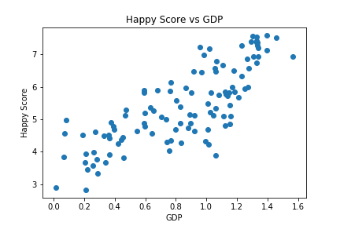

# Happiness Data - Create a Labelled Plot (Week 4)
This assignment aims to test if you can write the code necessary to load a CSV file, sort and filter the data, then to plot two columns of the data against each other, with labelled points and axes. You will also provide an explanation of why you think the data you have presented is of interest. 

I plotted happyScore against GDP to see if there is a correlation between the economic health of a country and the happy score. As per the graph, it shows a positive trend implying higher GDP generally leads to a higher happy score. I sorted the data for GDP in ascending order. I labelled the country with lowest and highest GDP to see their respective happy scores.
